# Database Architect & Tunning

## 1. Oracle architect

**<u>Overview architect:</u>**

- **PGA (program global area)**: memory dedicate to single user. Global session table (V_LOCAL_CONSTANT)

- **SGA (shared global area)**: use to improve database performance.
  
  - **<u>Shared pool</u>**:
    
    - Shared SQL area: cache execution plans, for all users.
    
    - Data dictionary cache: store columns and table names.
    
    - Result cache: first time query will slower than second or third time query, because result is already cache
  
  - **<u>Data buffer cache</u>**: store data for short period time, for increase database performance
  
  - Redo log buffer
  
  - Java pool & stream pool: java class and stream handling area.

- **Data files**: actual data of oracles, data, trigger, procedure, ...

**Data blocks**:

- Data in oracle store in data blocks

**Oracle PGA (private global area):**

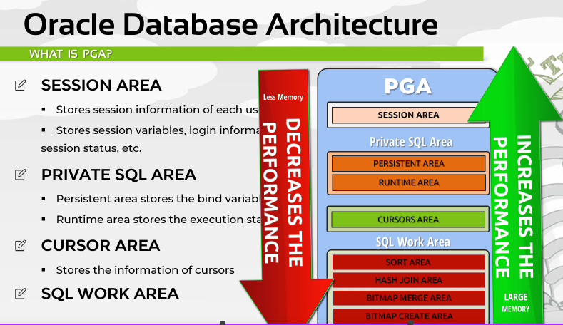

**Shared pool:**

- **<u>Result cache</u>**: cache result from queries

- **<u>SQL cache</u>**: store execution plans for all users

- **<u>Data dictionary cache</u>**: store colum name, table name, ...

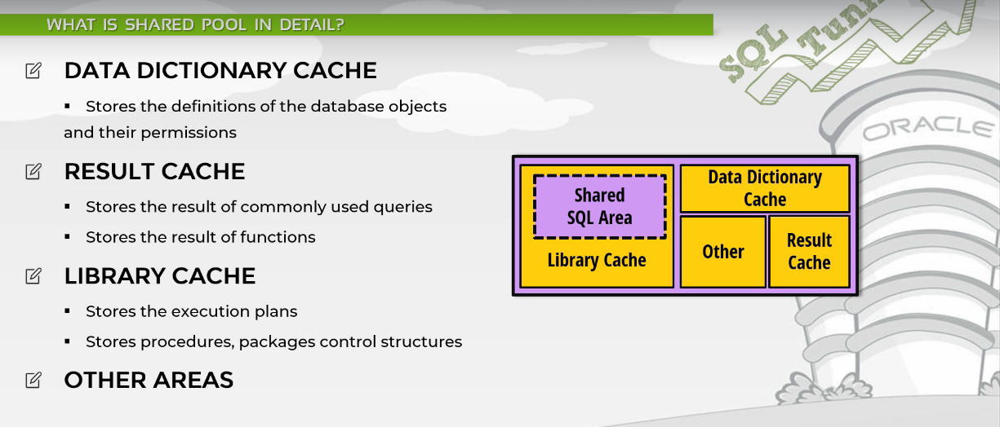

**Buffer cache:**

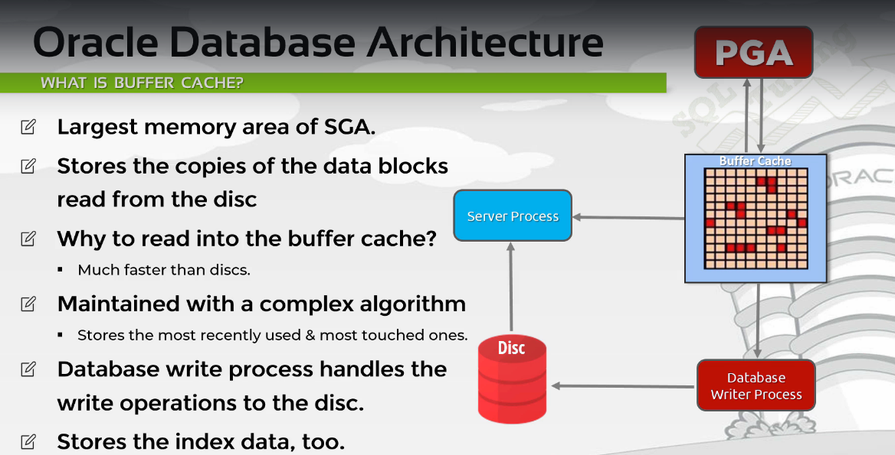

**Redo log buffer:**

Redo log buffer contain change of database.

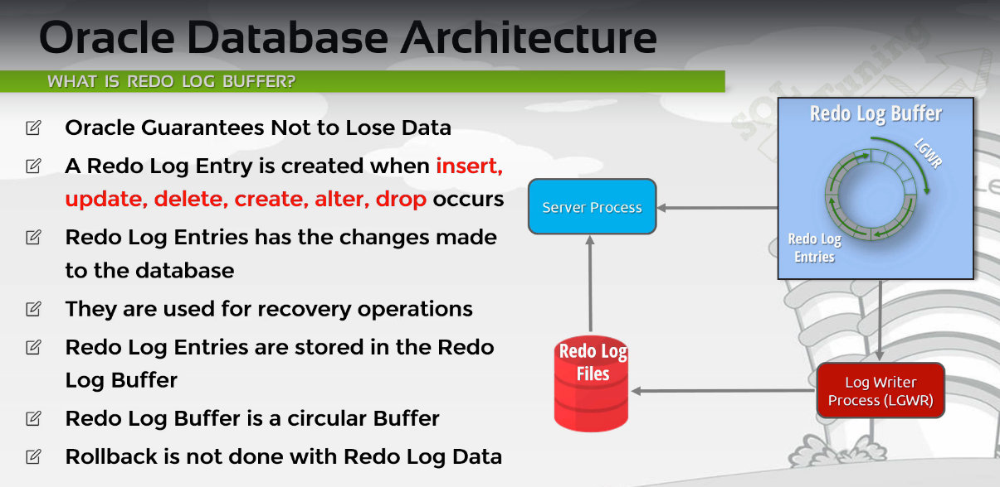

**How DML is process:**

1. Check sql shared pool for execution plan

2. Check Data dictionary cache and check if query is valid

3. Check database buffer cache

4. Lock the related blocks

5. Make change in database buffer cache

**<u>Oracle SQL Tunning:</u>**

**Bad SQL:**

**Effective schema design:**

- Choosing data type carefully:
  
  - For example: using integer for IP, using built in date time instead of String, VARCHAR is usually better, it have some more bytes to store length, CHAR is good for fix length value such as MD5 hash.

**Table patritioning:**

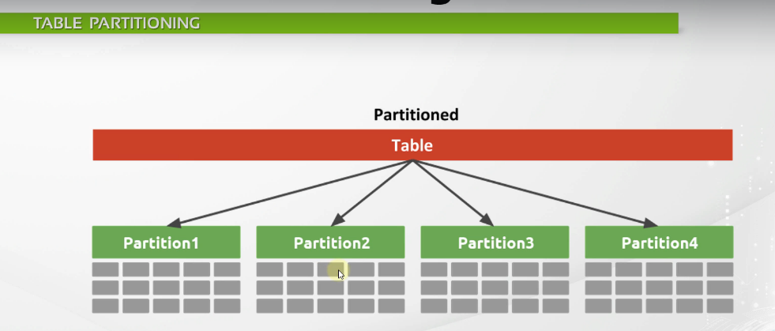

The organization schemes include:

- DISTRIBUTE BY HASH
- PARTITION BY RANGE
- ORGANIZE BY DIMENSIONS

As we keep adding rows to the table, size of primary key index and any other indexes on the table also grows. Once they grow to a point where the entire index does not fit in the configured size of buffer (place where it stores pages that are frequently accessed), the database engine will have to go and fetch index pages from disk and thus slowing down the query.

Its not superior or inferior to indexes, its a different technique.

**Advantages of partitioning**

- Smaller tables, smaller indexes, lower query latency.

**Disadvantages**

- intrusive as application needs changes to write to the correct partition. If the number of partitions is out-grown, you have the same issue with the partitions. AFAIK full re-partitioning would be needed to increase the partition count. Certainly a non-trivial activity.

**How SQL statement is processed:**

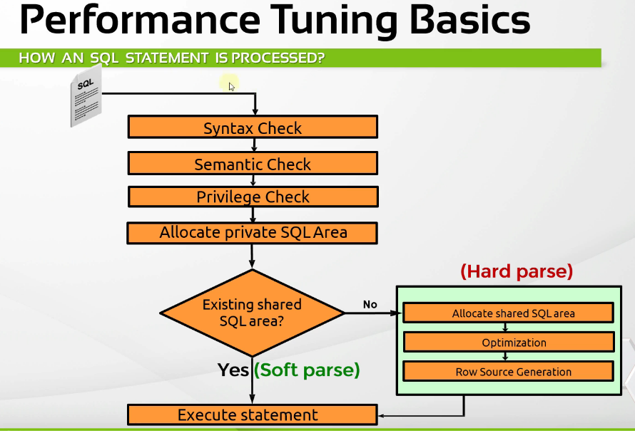

- Syntax check

- Semantic checking: checking table name, column name

- Privilege check

- Allow PGA

- If SQL area have existed execution plan:
  
  - Execute immediateply (soft parse)

- Otherwise do the hard parse.

**Optimizer:**

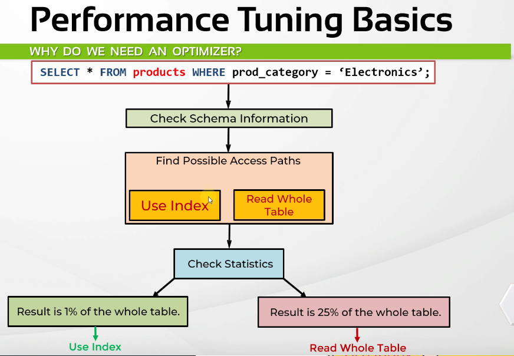

**Optimizer transformer:**

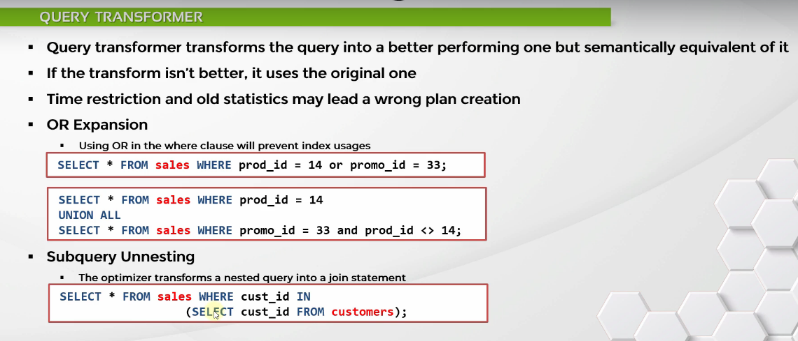

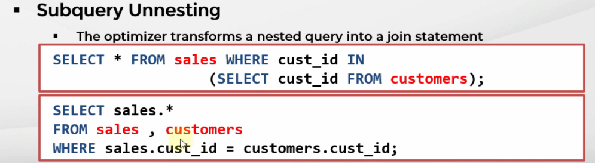

**Selectivity and Cardinity:**
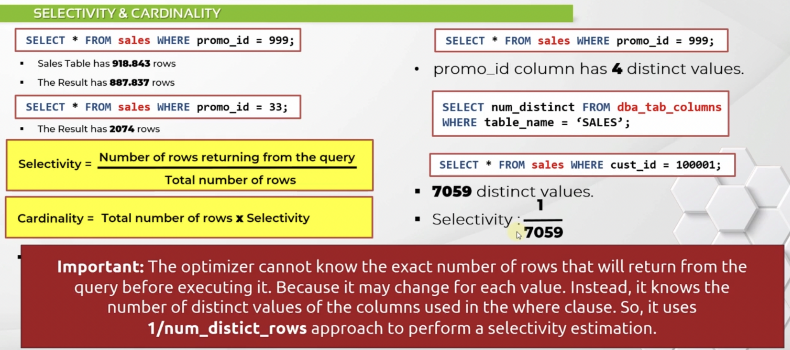

**Cost calculation:**

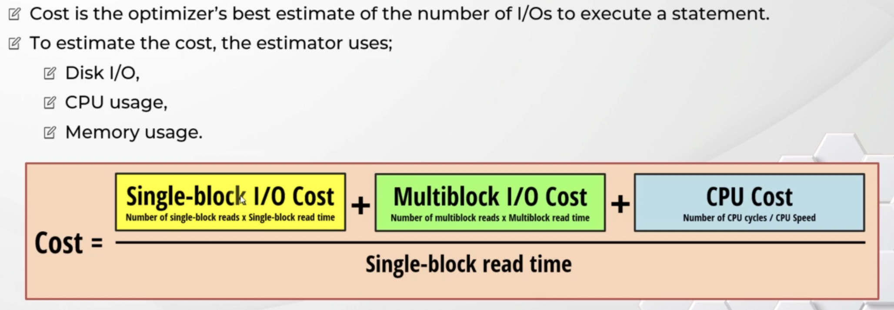

**Plan generator:**

- Generate Execution plan and estimate cost. Then pick the best plan with lowest cost

- For example the below queries generate two execution plan, the plan generator pick the first one with the lowest cost.

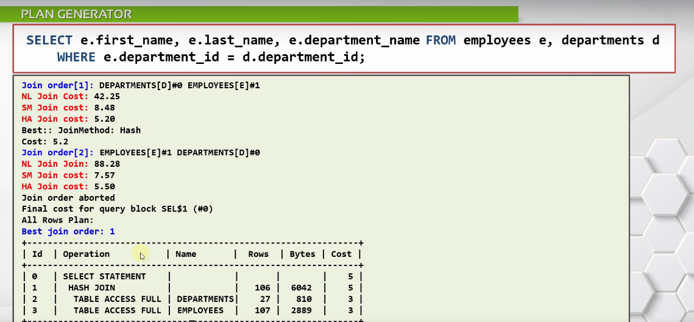

**Row source generator:**

- Populate executor plan to table and row

**Sql tuning and priciples:**

- Step 1: Identify the issue, slow cpu ? network ? ... 

- Step 2: Clarify the issue: identify table, indexing, ...

- Step 3: Collect report using report tooling, such as awr report oracle

- Step 4: Analyze the data

- Step 5: Choose appropriate tuning strategy: 
  
  - Parse time reduction: using connection pool. 
  
  - Plan comparision strategy: compare different plans
  
  - Quick solution strategy

**Analysis query:**

- Step 1: Collect execution plan, information of object in the queries, statistic, histogram
  
  - Using tools: DBMS_STATS, TKPROF, AWR Report, ...

- Step 2: Checking the queries:
  
  - Checking for: joins, views, sub queries, IN or OR list, ...

- Step 3: Checking excution plan
  
  - Using SQL Trace, TKPROF, ...

- Step 4: Read execution plan:
  
  - Access path: is it read whole DB or index
  
  - Join type

- Step 5: solution:
  
  - Create index
  
  - Create index organized table
  
  - Using hints

