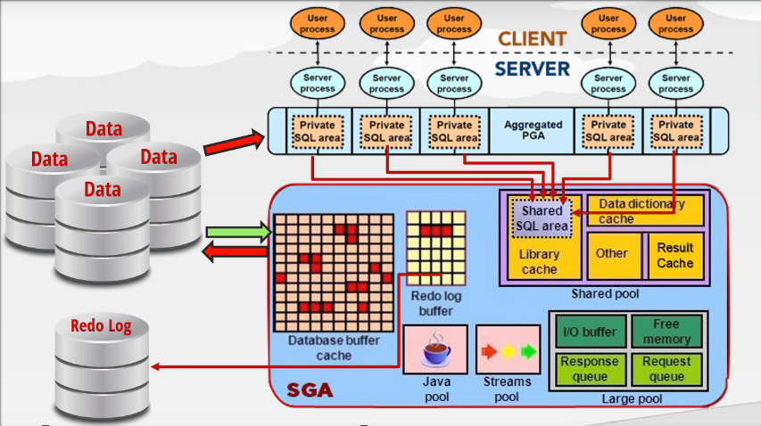

# Database Architect & Tunning

## 1. Oracle architect

**<u>Overview architect:</u>**

- **PGA (program global area)**: memory dedicate to single user.

- **SGA (shared global area)**: use to improve database performance.
  
  - **<u>Shared pool</u>**:
    
    - Shared SQL area: cache execution plans, for all users.
    
    - Data dictionary cache: store columns and table names.
    
    - Result cache: first time query will slower than second or third time query, because result is already cache
  
  - **<u>Data buffer cache</u>**: store data for short period time, for increase database performance
  
  - Redo log buffer
  
  - Java pool & stream pool: java class and stream handling area.

- **Data files**: actual data of oracles, data, trigger, procedure, ...

**Data blocks**:

- Data in oracle store in data blocks

**Oracle PGA (private global area):**

**Shared pool:**

- **<u>Result cache</u>**: cache result from queries

- **<u>SQL cache</u>**: store execution plans for all users

- **<u>Data dictionary cache</u>**: store colum name, table name, ...

**Buffer cache:**

**Redo log buffer:**

Redo log buffer contain change of database.

**How DML is process:**

1. Check sql shared pool for execution plan

2. Check Data dictionary cache and check if query is valid

3. Check database buffer cache

4. Lock the related blocks

5. Make change in database buffer cache

**<u>Oracle SQL Tunning:</u>**

**Bad SQL:**

**Effective schema design:**

**Table patritioning:**

**How SQL statement is processed:**

**Optimizer:**

**Optimizer transformer:**

