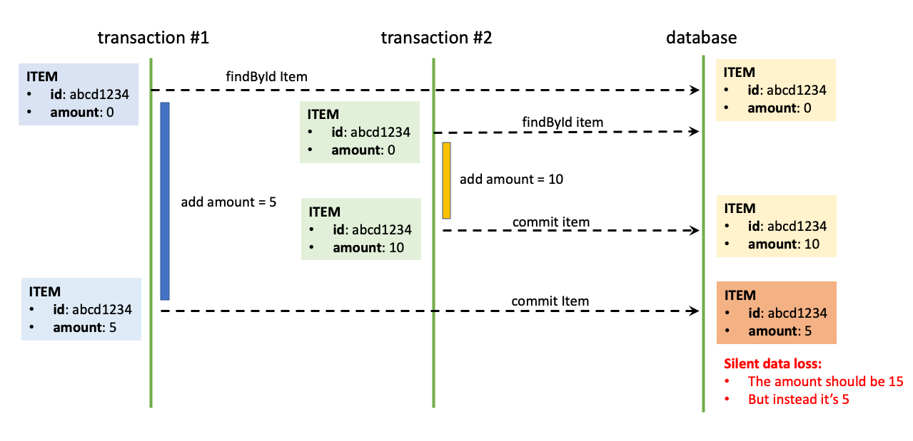
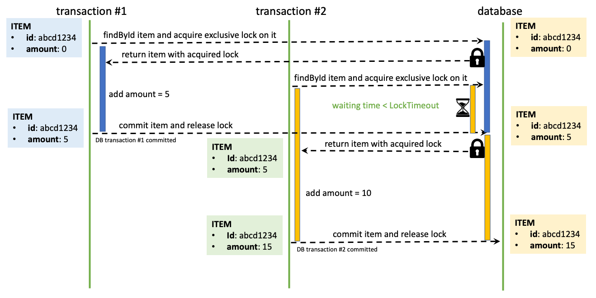
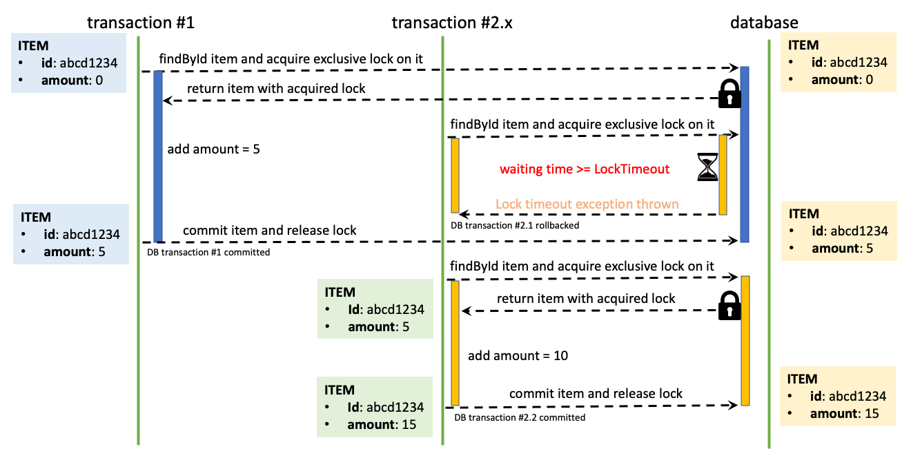
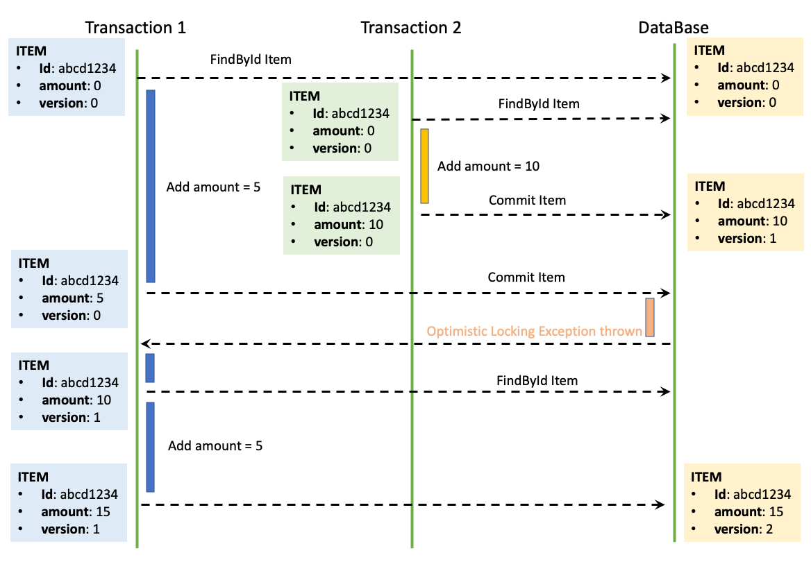

## Hibernate Advanced

## 1. Handling Locking with JPA

### 1.1 Pessimistic locking

Concurrency problems:



Permisstic locking:



Permisstic locking timeout:



JPA timeout settings:

```java
@Lock(LockModeType.PESSIMISTIC_WRITE)
@QueryHints({@QueryHint(name = "javax.persistence.lock.timeout", value = "3000")})
Optional<Item> getItemById(UUID id);
```

*This jpa query will try to acquire a pessimistic lock with LockTimeout set to 3 seconds (3000 ms).*

### 1.2 Optimistic locking



```java
@Setter
@Getter
@MappedSuperclass
public class BaseEntity {

    @Version
    private Long version;
}
```

- Adding *@Version* attribute is all what you need to activate the optimistic locking for an entity;
- In case most of your entities require optimistic locking mechanism, then it could be a good idea to create a BaseEntity class;
- The attribute *@MappedSuperclass* declares for JPA that this is not an entity, but it could be extended by other entities.

**<u>Implementation of Optimistic Locking:</u>**

```java
@Setter
@Getter
@MappedSuperclass
public class BaseEntity {

    @Version
    private Long version;
} 


// Handle Optimistic Locking
@Slf4j
@RequiredArgsConstructor
@Service
public class InventoryService {
    private final ItemService itemService;
    @Transactional(readOnly = true)
    public void incrementProductAmount(String itemId, int amount) {
        try {
            itemService.incrementAmount(itemId, amount);
        } catch (ObjectOptimisticLockingFailureException e) {
            log.warn("Somebody has already updated the amount for item:{} in concurrent transaction. Will try again...", itemId);
            itemService.incrementAmount(itemId, amount);
        }
    }
}
```

## 2. JDBC Connectivity

### 2.1 Database design for optimal performance

**<u>Table design:</u>**

Normally, databases planned for online transaction processing (OLTP) are typically more normalized than databases planned for online analytical processing (OLAP)

From a performance point of view, normalization is generally used where more INSERT/UPDATE/DELETE operations are required, while denormalization is used where more READ operations are required.

**<u>Vertical partitioning of a table</u>**

```sql
CREATE TABLE customer
(
customer_ID numeric(10,0) NOT NULL,
accountName character varying(60) NOT NULL,
accountNumber numeric(10,0) NOT NULL,
customer_Image bytea
);
```

This DDL will cause peformance issue due to the fetching of customer_Image.

```sql
CREATE TABLE customer (
customer_Id numeric(10,0) NOT NULL,
accountName character varying(60) NOT NULL,
accountNumber numeric(10,0) NOT NULL
); 


CREATE TABLE customer_Image (
customer_Image_ID numeric(10,0) NOT NULL,
customer_Id numeric(10,0) NOT NULL,
customer_Image bytea
);
```

**<u>Using stored procedures</u>**

Data access performance can be tuned by using stored procedures to process data in the database server to reduce the network overhead, and also by caching data within your application to reduce the number of accesses.

### 2.2 Transaction management

The concept of transactions can be described with four key properties: atomicity, consistency, isolation, and durability (ACID).

- Atomicity: all operation should be success or none success at all.

- Consistency: Once a transaction is completed and committed, then your data and resources will be in a consistent state that conforms to business rules

- Isolation: Row should be lock to prevent data corruption

- Durability: Once a transaction has completed, the results of the transaction are written to persistent storage and cannot be erased from the database due to system failure

**Isolation level:**

- **READ_UNCOMMITED**

- **READ_COMMITED**: Prevent lost updates. **Lock READ**

- **REPEATABLE_READ**: Prevent repeatable read (`A non-repeatable read occurs, when during the course of a transaction, a row is retrieved twice and the values within the row differ between reads`), **Lock READ + UPDATE**

- **SERIALIZABLE**: Prevent phantom read (`A phantom read occurs, when during the course of a transaction, the content of row is unchange but the number of rows being fetch is increase or decrease, new row have been add or removed`), **Lock READ + INSERT + UPDATE + DELETE**

**Connection pool**:

Connection pool help to avoid create new connection and use cache connection in pool, prevent create new connection everytime.

**When to avoid connection pooling**

- Report server: or any single user application

- Bactch job server: only run the end of the day or month, using connection pool don't benefit such application.
