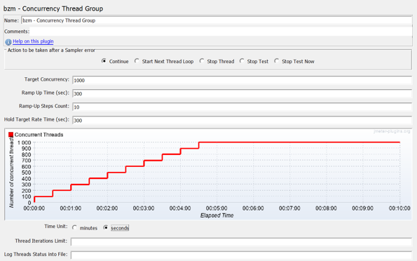
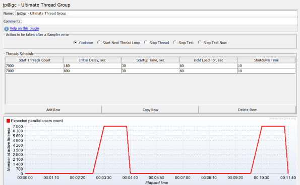

# Java peformance

## 1. Spring Peformance

### 1.1 Multithread and Concurrent

- Use immutable classes

- Use local variables

- Use thread pool

- Use the synchronization utility

- Use concurrent collections instead of synchronized collection

### 1.2 Inside JVM

**<u>JVM consist of three parts</u>**: 

- Class loader subsystem 

- Memory areas 

- Execution engine

**<u>Class loader subsystem</u>**:

- Boostrap subsystem: load JRE

- Extension loader: load external library

- System loader: load from class path

**<u>Memory area</u>**:

- **Heap area**: contain object, data store here is shared by multiple thread.

- **Stack area**: contain local variable and function stack, JVM creates one runtime stack for every thread in execution and stores it in the stack area.

- **Method area** (class info): static block variable, class reference, class infomation

- **PC**: program counter, These hold the addresses of current instructions under execution. Once the instruction is executed, the PC Registers will be updated with the next instruction.

- **Native method stacks**

**<u>Execution engine</u>**:

- Interpreter: read byte code and execute it

- JIT (just in time executor): compiler convert byte code to native code for faster execution in next time

- GC: destroy everything that not reference.

<u>**Understanding memory leak**:</u>

A memory leak occurs when the garbage collector could not collect the objects any longer being used/referenced by an application.

If the objects are not garbage collected, the application uses more memory and, once the entire heap is full, the object cannot be allocated, which leads to **<u>OutOfMemoryError</u>**

**<u>Common reasons for memory leaks</u>**

The following are the most common reasons for memory leaks:

- **Open streams**: While working on streams and readers, we often forget to close the streams, which eventually results in the memory leak.

- **Open connections**: We often forget to close opened HTTP, database, or FTP connections, which results in the memory leak.

- Collection object do not implement equal and hashCode

Fixing memory leak:

- Enable GC logs and fine-tune GC parameters

- Profiling

- Code review

### 1.3 Street testing

**KPI**:

- Reponse time
- Error Rate
- User load
- Response time
- Latency
- Connect time
- Throughput

**Load test**:

- Peform to test how many user server can handle

The following figure shows what a load test can look like in JMeter. This test analyzes adding 100 users every 30 seconds until reaching 1,000 users. The entire stepping process takes 300 seconds. After reaching 1,000 threads, all of them will continue running and hitting the server together for 5 minutes.

**Stress Testing**: use for detecting memory leak, KPI such as response time, ... 

- Spike test: suddenly ramp up number of concurrent user
- Soak test: running highly concurrent number of user for a long period of time 

### 1.4 Jmeter

